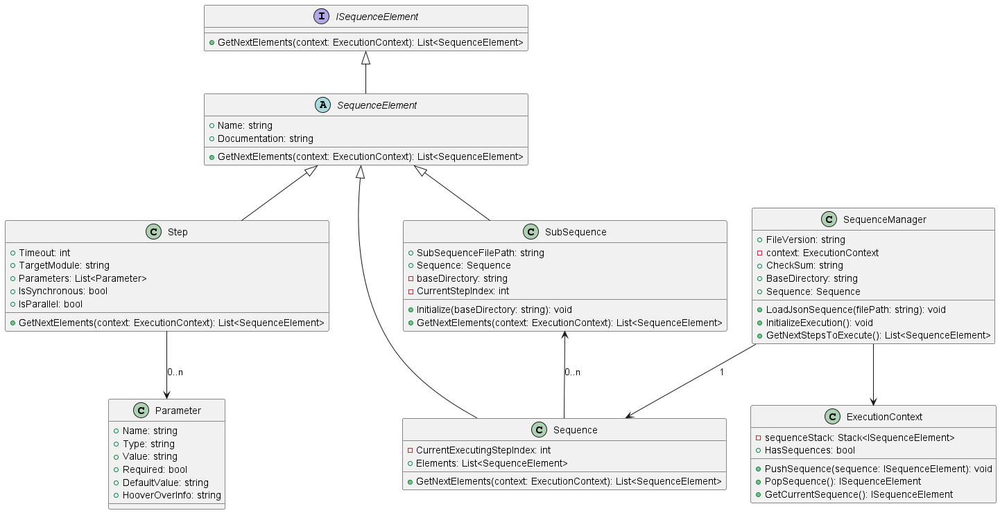

# Intention and Purpose of the Easy Sequence Manager

The intention of this C# sequencer or scheduler library is to serve as a standalone package that has control over the sequence of steps that have to be executed, but doesn't execute them on its own. To use this library, a different module that serves as orchestrator or brain of an application would call this Easy.SequenceManager to ask which step (or more precise: a series of parallel steps) should be executed next. If and when this next step is executed is then up to the orchestrator module.

## Features

- Load sequences from JSON files.
- Supports nested sub-sequences.
- Handle parallel and synchronous execution of steps.
- Extensible design for additional sequence element types.

## Usage

To use the Sequence Manager, you need to create a JSON file that defines your sequences and steps. Then, instantiate `SequenceManager` in your C# project and call `LoadJsonSequence` with the path to your JSON file.

### JSON Structure

The JSON file should follow this structure:

```json
{
  "SequenceManager": {
    "FileVersion": "1.0.0",
    "CheckSum": "checksum_here",
    "Sequence": {
      "Elements": [
        {
          "Type": "Step",
          "Name": "Step Name",
          "IsSynchronous": true,
          "IsParallel": false,
          "Documentation": "Description of step",
          "Parameters": [
            // Parameters for the step
          ]
        },
        {
          "Type": "SubSequence",
          "Name": "SubSequence Name",
          "SubSequenceFilePath": "path/to/subsequence.json"
        }
        // Other steps or sub-sequences
      ]
    }
  }
}
```
## Classes
The class diagram is shown in the file [class_diagram.puml](class_diagram.puml) and also visualized here:



- SequenceManager: Main class to load and manage sequences.
- Sequence: Represents a sequence of steps or sub-sequences.
- Step: Represents an individual step in a sequence.
- SubSequence: Represents a nested sequence.
- Parameter: Represents parameters used in steps.

## Methods
LoadJsonSequence(string filePath): Loads a sequence from a JSON file.
GetNextElementsToExecute(): Returns the next set of elements (steps or sub-sequences) to be executed.

## Example
```c#
var sequenceManager = new SequenceManager();
sequenceManager.LoadJsonSequence("path/to/sequence.json");

while (true)
{
    var nextElements = sequenceManager.Sequence.GetNextElementsToExecute();
    if (!nextElements.Any())
        break;

    // Execute each element in nextElements
}

```

# Development
This project is open for enhancements and contributions. Feel free to fork and improve the functionality or to add support for more complex sequence structures.

## Open Todo Items
- Get and Set Cheksum of a sequence (including its subsequences)
- ForLoop Step type
- Working with variables:
  - Enable Output parameter of steps and save outputs to variables
  - Define variables already in sequence structure